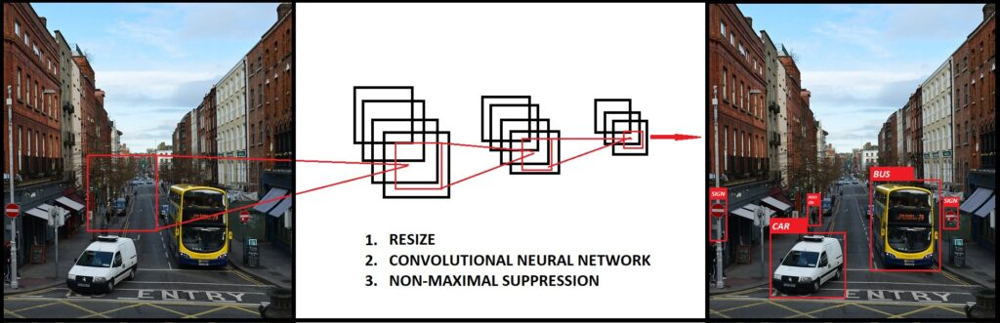
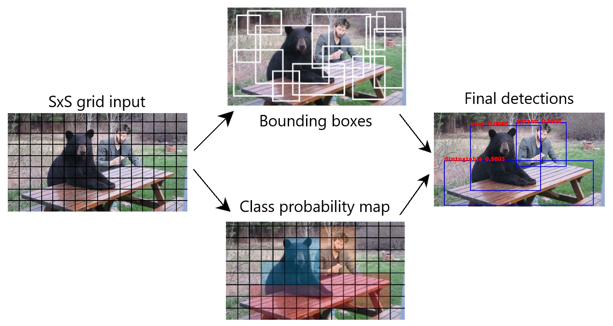
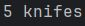
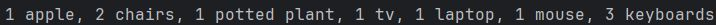
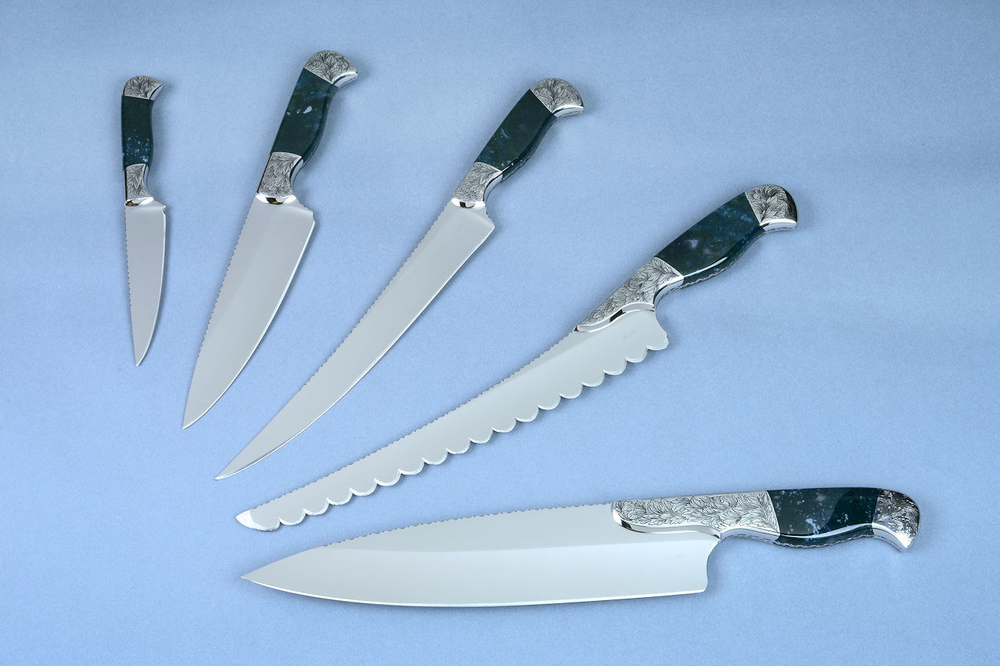
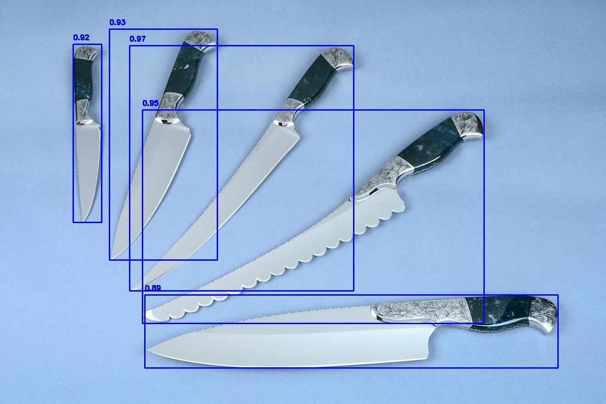
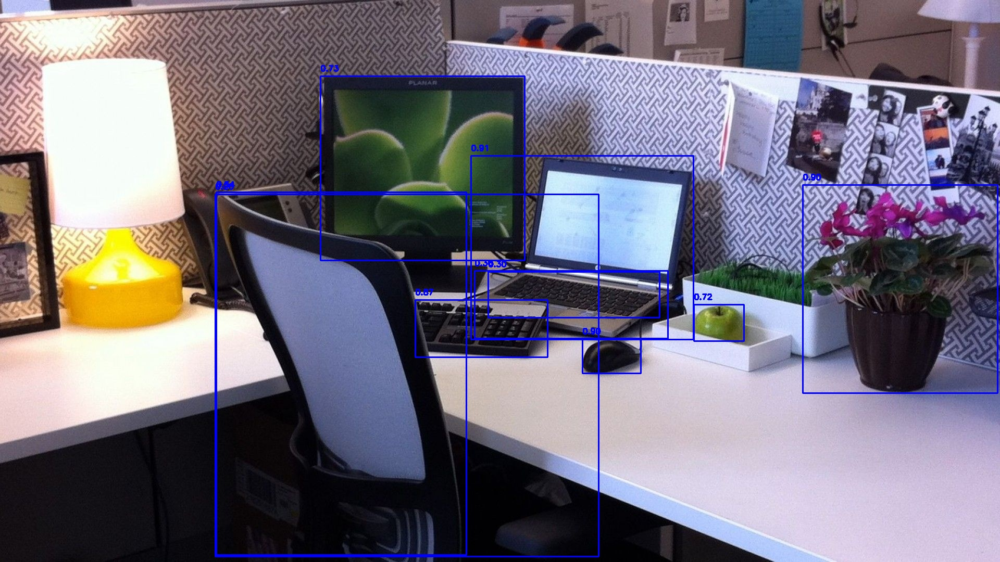

## Теоретическая база

Глубокие нейронные сети (ГНС) представляют собой многослойные структуры, способные автоматически извлекать признаки из данных. ГНС имитируют работу человеческого мозга, используя искусственные нейроны, которые взаимодействуют друг с другом с помощью весовых коэффициентов и функций активации. Основная цель глубокого обучения — создать архитектуры, способные эффективно обучаться на больших объёмах данных, находить скрытые закономерности и решать сложные задачи, такие как обработка изображений, видео и естественного языка.

Вычисления в нейросетях могут выполняться как на центральном процессоре (CPU), так и на графическом процессоре (GPU). Использование GPU значительно ускоряет обработку, особенно при работе с большими наборами данных и сложными моделями.

### YOLO:

YOLO – это система (сеть) обнаружения объектов. Она была разработана Джозефом Редмоном (Joseph Redmon). Наибольшим преимуществом YOLO над другими архитектурами является скорость. Модели семейства YOLO исключительно быстры и намного превосходят R-CNN (Region-Based Convolutional Neural Network) и другие модели. Это позволяет добиться обнаружения объектов в режиме реального времени.
 

YOLO необходимо только один взгляд на изображение, то метод скользящего окна не подходит в данной ситуации. Вместо этого, изображение будет поделено на сетку с ячейками размером S x S. Каждая ячейка может содержать несколько разных объектов для распознавания.

Во-первых, каждая ячейка отвечает за прогнозирование количества bounding box’ов. Также, каждая ячейка прогнозирует доверительное значение (confidence value) для каждой области, ограниченной bounding box’ом. Иными словами, это значение определяет вероятность нахождения того или иного объекта в данной области. То есть в случае, если какая-то ячейка сетки не имеет определенного объекта, важно, чтобы доверительное значение для этой области было низким.

Когда мы визуализируем все предсказания, мы получаем карту объектов и упорядоченных по доверительному значению, рамки.

Во-вторых, каждая ячейка отвечает за предсказание вероятностей классов. Это не говорит о том, что какая-то ячейка содержит какой-то объект, только вероятность нахождения объекта. Допустим, если ячейка предсказывает автомобиль, это не гарантирует, что автомобиль в действительности присутствует в ней. Это говорит лишь  о том, что если присутствует объект, то этот объект скорее всего автомобиль.
 

## Преимущества модели YOLO
Скорость: способна обрабатывать более 30 кадров в секунду, что делает её подходящей для приложений реального времени.

Одновременное обнаружение: модель может распознавать несколько объектов на одном изображении, что повышает её эффективность.

Генерация ограничивающих рамок: определяет координаты рамок и вероятность принадлежности к классам объектов.

## Результаты работы и тестирования системы

Для оптимизации использовалось ThreadPoolExecutor для параллельной обработки изображений, который расспаралеливал выполнение программы на 4 потока.
Система была протестирована на 2 изображениях:

### Сравнение результатов

| Метод          | Время выполнения | Использование памяти |
|----------------|------------------|--------------------- |
|Без оптимизации | 8.81 секунд      | 603.63 МБ            |
|С оптимизацией  | 1.26 секунд      | 636.52 МБ            |

С оптимизацией работает быстрее примерно в 7 раз, а памяти затрачивается ненамного больше.

Результат:
   
 
 

### Примеры изображений

1. Исходное изображение:
   
 

2. Обработанное изображение:
   
 

3. Исходное изображение:
   
 

4. Обработанное изображение:
   
 

## Выводы

В ходе работы была изучена архитектура глубоких нейронных сетей и реализована система обработки изображений с использованием модели YOLO.Использование многопоточности значительно сократило время выполнения детекции объектов. Система демонстрирует высокую точность обнаружения объектов, что делает её подходящей для использования в реальных приложениях.
